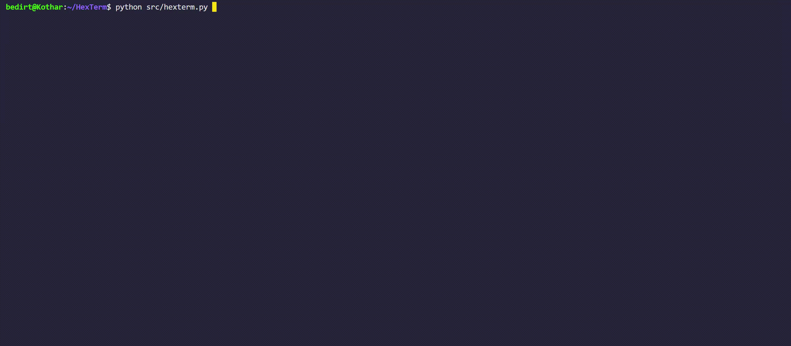

<div align="center">
    
    <p>Play Hex directly from your command line</p>
    
    
    
    
</div>


Hex is a strategic board game for two players played on a hexagonal grid. This implementation of the Hex game allows players to enjoy the game in a terminal interface, providing a convenient and accessible way to play Hex directly from your command line.

Here's a quick look at the game in action:


## Table of Contents

- [Features](#features)
- [Roadmap](#roadmap)
- [Usage](#usage)
  - [Download and Play](#download-and-play)
  - [Running from Source](#running-from-source)
- [Controls](#controls)
- [Installation](#installation)
  - [Installation for Development](#installation-for-development)
- [Contributing](#contributing)
- [License](#license)
- [Sources](#sources)

## Features

- Play Hex on various board sizes (from 4x4 to 15x15) with no dependencies.
- 2-player support with a simple turn-based system.
- Terminal-based UI for easy play.
- Simple navigation and game controls.
- Visual feedback for winning paths and invalid moves.

## Roadmap
- [ ] AI support (coming soon).
- [ ] Save and load game state.
- [ ] Game history and undo moves support.
- [ ] Network play support.

## Usage

### Download and Play

For those who prefer not to install from source or do not have Python installed, you can directly download the game's executable for your operating system in the [latest release](https://github.com/BedirT/HexTerm/releases), and you're ready to start playing Hex directly from your command line. No additional installation or setup required!

#### Possible Permissions Issue

After downloading, you may need to grant execution permissions to the file before running it (mainly for macOS and Linux). You can do this by running the following commands in your terminal (replace `hexterm_1.0.0_mac` with the name of the file you downloaded):

- **macOS and Linux**:
  ```bash
  chmod +x hexterm_1.0.0_mac
  ./hexterm_1.0.0_mac

Enjoy the game!

### Running from Source

To start the game, simply run the following command:

```bash
python hexterm.py
```

## Controls

- Use the arrow keys to navigate the board.
- Press `Enter` or `Space` to place a piece on the selected cell.
- Press `q` to quit the game at any time.

## Installation

Hexterm is built to have minimal dependencies. Currently the game requires no external libraries, and can be run with Python [Python 3.10](https://www.python.org/downloads/) or higher.

### Installation for Development

If you would like to contribute to the development of Hexterm, you can clone the repository and install the required dependencies. We recommend using a virtual environment to manage the dependencies, specifically we make use of [Poetry](https://python-poetry.org/).

1. Clone the repository:

```bash
git clone https://github.com/BedirT/HexTerm
cd HexTerm
```

2. Install the dev dependencies:

If you don't have Poetry installed, you can install it with the following command:

```bash
pip install poetry
```

Then, install the dependencies:

```bash
poetry install
```

You are ready to start contributing to Hexterm!

## Contributing

Contributions to the Hex game are welcome! Here's how you can contribute:

1. Fork the project.
2. Create your feature branch (git checkout -b feature/AmazingFeature).
3. Commit your changes (git commit -m 'Add some AmazingFeature').
4. Make sure to use `black/flake8/isort` for code formatting. Settings are already included in the `pyproject.toml` file and `.flake8` file.
5. Push to the branch (git push origin feature/AmazingFeature).
6. Open a pull request.

PS: Currently I have no tests included. Hopefully, I will add them some time.

## License

Distributed under the GNU AGPLv3 License. See `LICENSE` for more information.

## Sources

- [Hex game](https://en.wikipedia.org/wiki/Hex_(board_game)) - Wikipedia
- [Ryan B Hayward, Hex The Full Story](https://webdocs.cs.ualberta.ca/~hayward/hexbook/hex.html)